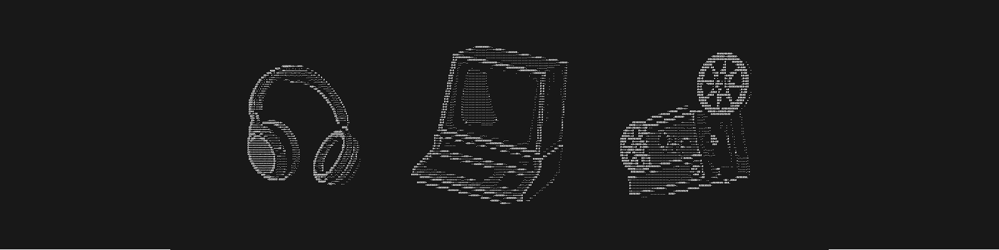

<div align="center">



# FORCE QUIT

**Professional Side-Quester.** Code, sound, and visuals.

[](https://www.youtube.com/@ForceQuitCreations)
[](https://linktr.ee/ForceQuit)

</div>

<!-- ascii:start -->

```
##################################################
##################################################
##################################################
##################################################
#####################      #######################      forcequit@me
##################   ###          ################      -------------------------------------------
#######################      #      ##############      OS .......... macOS, Windows, Linux
###################       #      #   #############      Host ........ Force Quit Productions
########             ####              ###########      Kernel ...... Creative Technologist
######                    ####   #   #  ##########      Shell ....... Claude Code
####      #                   ###  #     #########      Location .... Portugal
###  ## #                           ###   ########
###     #        ######               ##  ########      STACK --------------------------------------
####    #      ######################     ########      Code ........ Python, TypeScript, JavaScript
#######     ###############      #       #########      Markup ...... HTML, CSS
####################               ### #### ######      Design ...... Figma, Blender, Illustrator
#############         # #  #     ##### #  ########      Media ....... DaVinci Resolve, Ableton Live
######### ####     ##       #    #####  ## #######      Deploy ...... Cloudflare Pages, Raspberry Pi
###############   ####          ######  ##########      Spoken ...... English, Portuguese, German
########### ##   ######      ########    #########
###############################    ##   ##########      BUILDING -----------------------------------
################ ###    ### ### ####    ##########      Skills ...... vibecoder-mode
###################   #        #####     #########      Templates ... Claude Code x Blender, Remotion
################  ###############        #########      Plugins ..... Figma, Blender (10+)
######################    ### ##            ######      Hardware .... 6-SSD Pi NAS, desktops
############################                   ###
#################  ### #             #    #     ##      CONTACT ------------------------------------
#################### #            ###   ##   ##  #      Email ....... forcequitproductions@gmail.com
####################              #      ###            YouTube ..... @ForceQuitCreations
#################################   #                   Links ....... linktr.ee/ForceQuit
################################             ####
#######################               # ###### ##
##################       # #       ### ##########
###       ######    ##   ##      # ## ### ######
 ###           ###       #     ######### ####### #
```

<!-- ascii:end -->

I build web, brand, video, audio, 3D, and the tools around them.

Most of what's here is scaffolding for creative work that AI doesn't handle out of the box: Claude Code environments for Blender and Remotion, a skill for people who direct development without writing the code, and small tools that fix specific problems in my own pipeline.

My background is music production. That's where I learned to ask whether a thing serves the work or clutters it. Same question, different medium.

## Start here

<table>
<tr>
<td width="50%" valign="top">

### [vibecoder-mode](https://github.com/forcequit-me/vibecoder-mode)
A Claude skill for people who direct development without writing the code. Teaches you vocabulary instead of creating dependence.

</td>
<td width="50%" valign="top">

### [whispermerger](https://github.com/forcequit-me/whispermerger)
Offline speaker-labeled transcripts with word-level timestamps. WhisperX on a local GPU, FastAPI backend.

</td>
</tr>
<tr>
<td width="50%" valign="top">

### [Pro-Q4 Preset Merger](https://pro-q4-merger.pages.dev/)
Merge, blend, and edit FabFilter Pro-Q 4 presets in the browser. Live, nothing to install.

</td>
<td width="50%" valign="top">

### [Redaction Master](https://github.com/forcequit-me/Redaction-Master-Figma-Plugin)
Figma plugin that redacts sensitive content in design files.

</td>
</tr>
<tr>
<td width="50%" valign="top">

### [Claude Code x Remotion](https://github.com/forcequit-me/Claude-Code-Remotion-Template)
Programmatic video with Remotion, React, and TypeScript. 21 slash commands, 9 skills, 8 agents.

</td>
<td width="50%" valign="top">

### [Claude Code x Blender](https://github.com/forcequit-me/blender-addon-template)
Addon development with live in-Blender testing, API validation, and generated boilerplate.

</td>
</tr>
</table>

---

<div align="center">

*Portfolio site coming soon.*

</div>